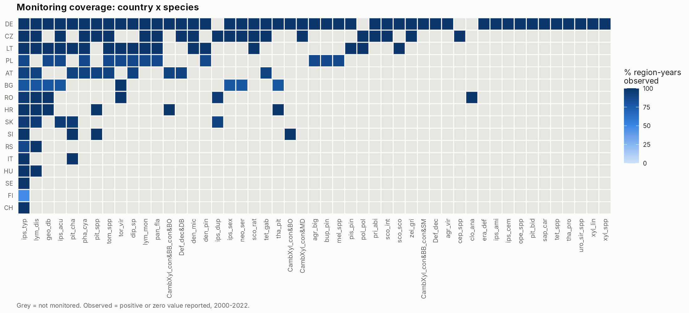
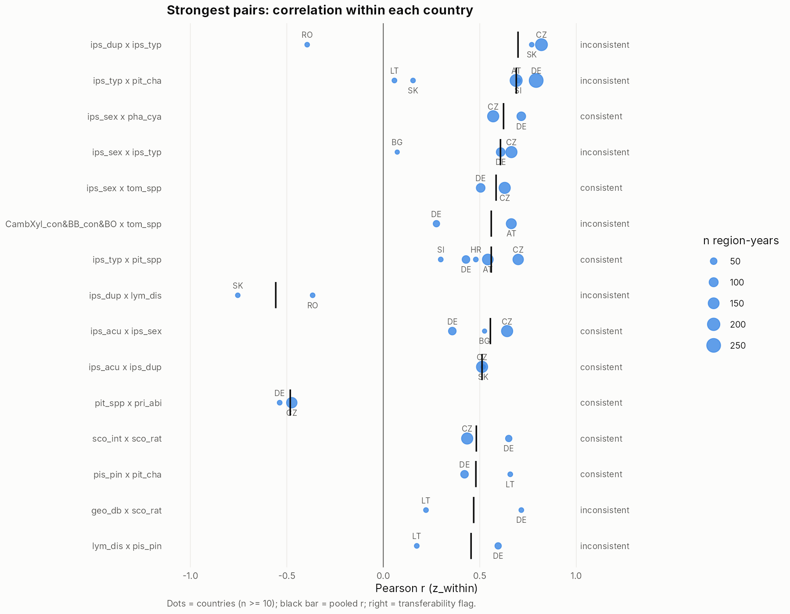
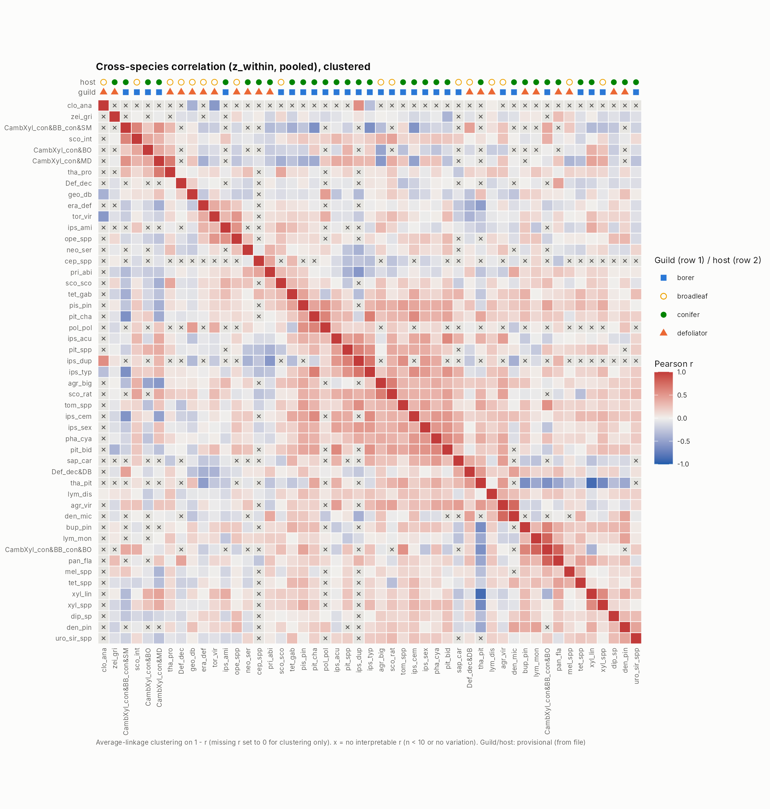

```{r setup}
library(dplyr)
library(targets)
store <- "../_targets"
rd <- function(x) tar_read_raw(x, store = store)
f2 <- function(x) formatC(x, format = "f", digits = 2)
pct <- function(x) paste0(round(x), "%")

counts <- rd("counts"); cells <- rd("cells"); cov_country <- rd("cov_country")
pw <- rd("pw"); pw_nf <- rd("pw_nofilter"); tr <- rd("tr"); tr_nf <- rd("tr_nofilter")
ts <- rd("ts"); tvs <- rd("tvs"); perm <- rd("perm"); pc <- rd("pc")
lookup <- rd("guild_lookup"); meta <- rd("species_meta"); t6 <- rd("paper_t6")

add_pw <- function(x, v) x |>
  left_join(pw |> filter(version == v) |> select(species_a, species_b, n_both_positive),
            by = c("species_a", "species_b"))
tz <- ts |> filter(version == "z_within") |> add_pw("z_within") |>
  left_join(pw_nf |> filter(version == "z_within") |> select(species_a, species_b, r_nofilter = r_pearson),
            by = c("species_a", "species_b"))
ta <- ts |> filter(version == "anomaly") |> add_pw("anomaly")
interp <- tz |> filter(!is.na(r_pooled), n_pooled >= 10)

za <- pw |> filter(version %in% c("z_within", "anomaly"), !low_n) |>
  select(species_a, species_b, version, r_pearson) |>
  tidyr::pivot_wider(names_from = version, values_from = r_pearson) |>
  filter(!is.na(z_within), !is.na(anomaly))
n_series <- function(x) n_distinct(paste(x$nuts_id, x$species))
pair_r <- function(d, a, b) d$r_pooled[d$species_a == a & d$species_b == b]
```

## Key findings

1. **Our data reproduce the paper.** Europe-wide correlations from our data match Table 6 of Hlásny et al. (2025) to within `r f2(max(t6$abs_diff_paper_vs_r2))` — **but only when the paper's values are read as r² (squared correlations), not r.** This confirms our processing and suggests Table 6 reports r² with the sign removed (see below).
2. **Much of the synchrony between species is shared bad years.** Europe-wide series correlate strongly (e.g. *I. typographus* × *P. cyanea* r = `r f2(t6$r_ours[t6$species_a=="ips_typ" & t6$species_b=="pha_cya"])`), but regional series much less. After removing the Europe-wide year signal, about half of the strong regional links remain (`r sum(abs(za$z_within) >= .4 & abs(za$anomaly) >= .3)` of `r sum(abs(za$z_within) >= .4)`), so species carry real information about each other beyond common drought years.
3. **Bark beetles link together, also across countries.** With the CZ spruce group treated as *I. typographus* (the paper's rule), *I. typographus* now has testable links in up to `r max(tz$n_countries[tz$species_a=="ips_typ"|tz$species_b=="ips_typ"], na.rm=TRUE)` countries; links to *Pityokteines* (`pit_spp`), *I. acuminatus* and *Phaenops* are consistent, and *Tomicus* becomes consistent once shared bad years are removed. The strongest partner, *P. chalcographus*, remains inconsistent between countries.
4. **Transferability is still the bottleneck.** `r sum(tz$transferability == "insufficient data")` of `r nrow(tz)` pairs cannot be tested across countries.
5. **Guild structure is confirmed**, matching the paper: same-guild pairs correlate more than cross-guild pairs, also after removing year effects; host type alone does not.

## What changed from version 1

Following Hlásny et al. (2025):

- **Series filter.** Region-species series with fewer than 6 non-zero values are removed (paper Sect. 2.5). This keeps `r n_series(tr)` of `r n_series(tr_nf)` series and replaces the earlier ad-hoc "suspect zero" rule. The unfiltered run is kept as a sensitivity check.
- **CZ spruce bark-borer group → *I. typographus*.** The paper treats a group dominated by one species as that species (Sect. 2.2). CZ reports `CambXyl_con&BB_con&SM` instead of `ips_typ`; it is now recoded. DE keeps both codes, as it reports them separately.
- **New version `anomaly`**: each series with the same species' Europe-wide yearly mean (from all other regions) removed. It isolates regional co-variation beyond shared bad years.
- **`value2` explained:** the paper notes that DE, BG, FI, RO and LT reported some damage in both area and volume units — exactly the countries with `value2`. It is the second unit; conversion factors are in the paper's Appendix B. `value1` remains the damage variable.

## Data and decisions

Source: `EUForDam_REW3.xlsx`, sheet `EUForDam_REW`: `r counts$n_rows` rows, `r counts$n_countries` countries, `r counts$n_species` species codes, `r counts$n_regions` regions, `r counts$year_min`–`r counts$year_max`.

- **Damage = `value1`**, `log(x + 1)` as in the paper.
- **CZ sub-rows summed to NUTS2** (1–3 rows per NUTS2-year-species, probably kraje). CZ values are multiples of 1/7 (cause unknown; a constant factor does not affect within-series correlations).
- **Zeros are real** unless the series has fewer than 6 non-zero values. NA values and missing rows are *not monitored*.
- **Other aggregate codes are kept as their own units** and flagged (`r paste(meta$species[meta$is_aggregate], collapse = ", ")`).
- **Units** are fixed per species (defoliators ha, borers m³). NUTS level differs by country, so raw `log_damage` levels are **not comparable across countries**; the within-series versions are.
- **Data quality:** the paper reports lower completeness for FI and SE; both report only *I. typographus*, so they barely enter pairwise results.
- **"Impossible" (host absent)** is still a placeholder. The paper compiled host-tree abundance per region (its Appendix D), which would fill it.

## Comparison with Hlásny et al. (2025), Table 6

The paper's Table 6 gives correlations between Europe-wide total damage series of nine species. We summed our data over all regions per species and year (untransformed, CZ group recoded) and correlated them.

```{r t6}
t6 |> arrange(desc(paper_value)) |>
  transmute(pair = paste(species_a, "×", species_b), `paper (Table 6)` = f2(paper_value),
            `our r²` = f2(r2_ours), `our r` = f2(r_ours), `our p` = signif(p_ours, 2),
            `our r, detrended` = f2(r_ours_detrended))
```

- The paper's values equal our **r²** (mean absolute difference `r formatC(mean(t6$abs_diff_paper_vs_r2), format = "f", digits = 3)`), while they differ from our r by `r f2(mean(t6$abs_diff_paper_vs_r))` on average. Table 6 therefore appears to report squared correlations, which explains why the paper notes that all correlations were non-negative.
- `r sum(t6$r_ours < 0)` of 36 pairs are actually **negative**, e.g. *I. acuminatus* × *T. viridana* (r = `r f2(t6$r_ours[t6$species_a=="ips_acu" & t6$species_b=="tor_vir"])`, shown as 0.17). None of the negative pairs reaches the paper's significance threshold (p < 0.001), so the paper's highlighted results are unaffected — but the table caption should say r², and signs matter for gap-filling.
- **This is worth raising with Prof. Hlásny privately** before relying on Table 6 elsewhere.
- Europe-wide totals are dominated by a few big years (2003, 2018–2020) and by Germany. Detrending changes several values substantially (last column), so continental synchrony partly reflects shared long-term trends.

## Species – NUTS occurrence ranking

Suggested by Prof. Hlásny. *Occurs* = at least one year with damage > 0 in a NUTS unit; *usable series* = at least 6 such years (the paper's filter). Damage shares and ranks are within unit (m³ for borers, ha for defoliators). National-level countries count as one unit each. Full tables, including the ranking of species within every region and a region × species matrix, are in `outputs/tables/species_nuts_occurrence_ranking.xlsx`.

```{r ranking}
rd("sp_rank") |>
  transmute(rank = rank_by_regions, species, guild, unit,
            countries = n_countries_occurring,
            `regions occurring / monitored` = paste(n_regions_occurring, "/", n_regions_monitored),
            `usable series` = n_usable_series,
            `% of all damage (unit)` = f2(pct_of_unit_total),
            `damage rank (unit)` = rank_by_damage_within_unit)
```

```{r top-per-region}
rr <- rd("reg_rank") |> filter(rank_in_region == 1, total_damage > 0)
rr |> count(unit, species, name = "regions where #1") |> arrange(unit, desc(`regions where #1`))
```

*I. typographus* occurs in `r rd("sp_rank")$n_regions_occurring[rd("sp_rank")$species=="ips_typ"]` of `r rd("sp_rank")$n_regions_monitored[rd("sp_rank")$species=="ips_typ"]` monitored units and is the largest borer in `r sum(rr$species=="ips_typ")` of them. Among defoliators no single species dominates: *L. monacha*, *L. dispar* and *Melolontha* lead in different regions. Many species occur in few units, mostly within Germany, which is the same limitation seen in the transferability analysis.

## Coverage



Of `r format(nrow(cells), big.mark = ",")` region-year-species cells, `r pct(100*mean(cells$status=="observed_positive"))` are observed positive, `r pct(100*mean(cells$status=="observed_zero"))` observed zero and `r pct(100*mean(cells$status=="not_monitored"))` not monitored.

```{r coverage-country}
cov_country |>
  transmute(country, cells = n_cells,
            `% positive` = round(pct_observed_positive, 1), `% zero` = round(pct_observed_zero, 1),
            `% not monitored` = round(pct_not_monitored, 1)) |>
  arrange(`% not monitored`)
```

## Pairwise correlations

`r nrow(interp)` of `r nrow(tz)` species pairs have an interpretable pooled `z_within` correlation (n ≥ 10 co-observed region-years). Strength of |r|: `r paste(names(table(interp$strength)), table(interp$strength), sep = " ", collapse = ", ")`.

```{r versions}
pw |> filter(!low_n, !is.na(r_pearson)) |>
  mutate(version = factor(version, c("z_within", "detrended", "anomaly", "diff", "log_damage"))) |>
  group_by(version) |>
  summarise(pairs = n(), `median |r|` = f2(median(abs(r_pearson))),
            `pairs |r| ≥ 0.5` = sum(abs(r_pearson) >= 0.5),
            `pairs FDR < 0.05` = sum(fdr_pearson < 0.05, na.rm = TRUE),
            `share r > 0` = pct(100 * mean(r_pearson > 0)))
```

**p-values are optimistic**: years within a series are autocorrelated and region-years are not independent. Effect size, n and cross-country consistency are the main evidence; the next step (mixed models with AR(1), as in the paper) will give honest uncertainty.

**Series-filter sensitivity.** Pooled `z_within` r with and without the ≥ 6 non-zero filter correlate `r f2(cor(tz$r_pooled, tz$r_nofilter, use = "complete"))`. The filter mainly removes sparse series whose correlations were driven by shared zeros.

### How much is shared bad years? (`z_within` vs `anomaly`)

For the `r nrow(za)` pairs with both estimates, median r falls from `r f2(median(za$z_within))` to `r f2(median(za$anomaly))` after removing each species' Europe-wide year signal; the two versions correlate `r f2(cor(za$z_within, za$anomaly))`. Of the `r sum(abs(za$z_within) >= .4)` pairs with |r| ≥ 0.4, `r sum(abs(za$z_within) >= .4 & abs(za$anomaly) >= .3)` keep |r| ≥ 0.3. For gap-filling this means a year effect learned from other countries explains part of the co-variation, but a helper species adds information beyond it — which the modelling step must test explicitly.

## Temporal vs spatial

Temporal = pooled `z_within` r; spatial = r between region means of `log_damage`. Linked = |r| ≥ 0.3.

```{r tvs}
tvs |> count(linked_by, name = "pairs") |> arrange(desc(pairs))
```

"Place only" links mostly reflect region size (large regions and nationally reported countries have more of everything) and are weak evidence for gap-filling.

## Transferability across countries — most important

Rules: **consistent** = ≥ 2 countries with n ≥ 10, every country r has the pooled sign, SD of country r ≤ 0.2, and no leave-one-country-out sign flip; **inconsistent** = ≥ 2 countries but a rule fails; **insufficient data** = < 2 countries.

```{r transfer-count}
ts |> count(version, transferability) |>
  tidyr::pivot_wider(names_from = transferability, values_from = n)
```

### Strongest consistent pairs (`z_within`)

```{r consistent}
tz |> filter(transferability == "consistent") |>
  arrange(desc(abs(r_pooled))) |> slice_head(n = 15) |>
  transmute(pair = paste(species_a, "×", species_b), n = n_pooled, `n both > 0` = n_both_positive,
            r = f2(r_pooled), countries = countries_n10, `SD r` = f2(r_sd),
            `max LOCO change` = f2(loco_max_abs_change))
```

### Consistent pairs beyond shared bad years (`anomaly`)

These pairs co-vary regionally after removing each species' Europe-wide year signal and do so consistently across countries — the best candidates for helper species in gap-filling.

```{r consistent-anomaly}
ta |> filter(transferability == "consistent") |>
  arrange(desc(abs(r_pooled))) |> slice_head(n = 15) |>
  transmute(pair = paste(species_a, "×", species_b), n = n_pooled, r = f2(r_pooled),
            countries = countries_n10, `SD r` = f2(r_sd))
```

### Strong but inconsistent pairs



```{r inconsistent}
tz |> filter(transferability == "inconsistent") |>
  arrange(desc(abs(r_pooled))) |> slice_head(n = 12) |>
  transmute(pair = paste(species_a, "×", species_b), n = n_pooled, r = f2(r_pooled),
            countries = countries_n10, `min r` = f2(r_min), `max r` = f2(r_max),
            `sign agree` = pct(100 * sign_consistency), `most influential` = loco_most_influential)
```

### *I. typographus* as a helper species

*I. typographus* is monitored almost everywhere, so it is the natural helper for gap-filling.

```{r ityp}
ts |> filter(version %in% c("z_within", "anomaly"), species_a == "ips_typ" | species_b == "ips_typ",
             !is.na(r_pooled), n_countries >= 2) |>
  mutate(partner = if_else(species_a == "ips_typ", species_b, species_a)) |>
  select(partner, version, r_pooled, countries_n10, transferability) |>
  tidyr::pivot_wider(names_from = version, values_from = c(r_pooled, transferability)) |>
  arrange(desc(abs(r_pooled_z_within))) |>
  transmute(partner, `r (z_within)` = f2(r_pooled_z_within), `flag (z_within)` = transferability_z_within,
            `r (anomaly)` = f2(r_pooled_anomaly), `flag (anomaly)` = transferability_anomaly,
            countries = countries_n10)
```

## Guild structure

Guild/host lookup used: **`r unique(lookup$lookup_source)`** (borer vs defoliator from the file's indicator columns; conifer vs broadleaf from TREETYPE). Fill in `data/lookup/species_guild_TEMPLATE.csv`, save as `data/lookup/species_guild.csv` and rerun to use your classification.



```{r perm}
perm |> transmute(grouping, version, `pairs within` = n_within, `pairs between` = n_between,
                  `mean r within` = f2(mean_r_within), `mean r between` = f2(mean_r_between),
                  difference = f2(diff_observed), `p (permutation)` = signif(p_perm_one_sided, 2))
```

Same-guild pairs correlate more strongly than cross-guild pairs in all three versions (9,999 label permutations, seed 20261008), including after removing Europe-wide year effects. Host type alone does not separate species. This agrees with the paper's conclusion of synchrony within, not between, feeding guilds.

Clustering caveat: `r rd("clust")$n_missing_set_to_zero` species pairs without an interpretable r were set to r = 0 for clustering only. The matching n heatmap is `outputs/figures/n_coobserved_heatmap.png`.

## Next step: gap-filling models

Following the paper's framework (glmmTMB, `log(x+1)`, region random effects, AR(1), zero-inflation):

```
log(target + 1) ~ log(helper + 1) * year + VPD + host abundance
                  + (1 | region) + ar1(year | region),  zi = ~ 1
```

1. **Baseline to beat:** region + year effects only (does the Europe-wide year signal already fill the gap?).
2. Add *I. typographus* as helper, then the best consistent helper per target (tables above).
3. Add VPD and host abundance (the paper's predictors).
4. Validate by **leave-one-country-out prediction**, since gaps are whole countries.

## Open questions for Prof. Hlásny

1. **Table 6:** are the values r² rather than r? Several underlying correlations are negative.
2. **Dataset version:** our file has `r counts$n_regions` regions and `r counts$n_species` codes; the paper reports 82 spatial units and 50 species (Zenodo 10.5281/zenodo.15863174). Which should the PhD use?
3. **Appendix B and D:** conversion factors, which Polish species were split from groups by fixed proportions, and host-tree abundance per region (fills the "impossible" class).
4. **VPD per region** as used in the paper.
5. **CZ values in multiples of 1/7** — known cause?
6. **Other group codes:** should any besides the CZ spruce group be mapped to a dominant species?

## Files

- Tables: `outputs/tables/` — `species_nuts_occurrence_ranking.xlsx` (also as `species_occurrence_ranking.csv`, `region_species_ranking.csv`, `occurrence_matrix_region_species.csv`), `pairwise_correlations.csv`, `pairwise_correlations_sensitivity_no_series_filter.csv`, `paper_table6_replication.csv`, `temporal_vs_spatial.csv`, `per_country_correlations.csv`, `leave_one_country_out.csv`, `transferability_summary.csv`, `coverage_*.csv`, `guild_permutation_test.csv`, `transform_versions.csv`
- Figures: `outputs/figures/`
- Guild template: `data/lookup/species_guild_TEMPLATE.csv`
