```{r setup}
library(dplyr)
library(targets)
store <- "../_targets"
rd <- function(x) tar_read_raw(x, store = store)
f2 <- function(x) formatC(x, format = "f", digits = 2)
pct <- function(x) paste0(round(x), "%")

counts <- rd("counts"); cells <- rd("cells"); cov_country <- rd("cov_country")
tr <- rd("tr"); tr6 <- rd("tr_paper6"); pw <- rd("pw"); pw6 <- rd("pw_paper6")
ts <- rd("ts"); perm <- rd("perm"); meta <- rd("species_meta"); t6 <- rd("paper_t6")
cm <- rd("cm"); cms <- rd("cm_species"); lags <- rd("cm_lags")
lsc <- rd("lfm_score"); lbest <- rd("lfm_best"); lgrid <- rd("lfm_grid"); lcv <- rd("lfm_cv_res")

n_series <- function(x) n_distinct(paste(x$nuts_id, x$species))
tz <- ts |> filter(version == "z_within")
skill <- function(m) lsc$skill_vs_year_baseline[lsc$model == m]
cms_tot <- cms |> mutate(total = strong_links + strong_but_shared_years + weak_links) |> arrange(desc(total))
```

## Key findings

1. **Insects carry information about each other.** Of `r nrow(cm)` insect pairs, `r sum(!is.na(cm$same_year))` can be measured; `r sum(cm$link == "strong, beyond shared bad years")` show a strong link that survives removing Europe-wide bad years, and `r sum(cm$link == "strong, mostly shared bad years")` more are strong mainly because of shared bad years.
2. **The strongest links are among bark beetles on conifers** (spruce, pine, fir, larch), often on the same host tree,, and same-guild species correlate more than cross-guild species (permutation test), matching Hlásny et al. (2025).
3. **A latent factor model fills gaps `r pct(100 * lbest$skill_vs_year_baseline)` better than Europe-wide yearly averages**, tested by hiding whole country × species blocks. It also beats the best single helper species.
4. **Transfer between countries is the bottleneck:** `r sum(tz$transferability == "insufficient data")` of `r nrow(tz)` pairs are recorded together in fewer than two countries, so it cannot be checked whether their link holds elsewhere.
5. **Our processing reproduces the paper's Table 6** exactly, but only when its values are read as r², not r (see below).

## Data and decisions

Source: `EUForDam_REW3.xlsx`, sheet `EUForDam_REW`: `r counts$n_rows` rows, `r counts$n_countries` countries, `r counts$n_species` insect codes, `r counts$n_regions` regions, `r counts$year_min`–`r counts$year_max`.

- **Zeros and empty cells (confirmed Oct 2026):** **0 = monitored, no damage** (a real observation); **empty = not monitored** (a true gap). All recorded values, including zeros, are used. This replaces the earlier choice to drop series with fewer than 6 damage years (Hlásny et al. 2025, Sect. 2.5), which is kept only as a sensitivity check. The main analysis now uses `r n_series(tr)` region-insect series instead of `r n_series(tr6)`.
- **Damage = `value1`**, analysed as `log(x + 1)` as in the paper. `value2` is the same damage in a second unit (area vs volume), reported by DE, BG, FI, RO and LT (paper Sect. 2.2).
- **CZ:** sub-region rows summed to NUTS2. The CZ spruce bark-borer group (`CambXyl_con&BB_con&SM`) is treated as *I. typographus*, following the paper's rule for groups dominated by one species. Other group codes are kept as their own units.
- **Units** are fixed per insect (defoliators ha, borers m³), but NUTS level differs by country (national for 11 countries), so damage *levels* are not comparable across countries. Correlations use within-series standardised values (`z_within`), which are.
- **Host absent ("impossible")** is still a placeholder; it needs host-tree abundance per region (paper Appendix D).

## Coverage and occurrence

Of `r format(nrow(cells), big.mark = ",")` region-year-insect cells, `r pct(100*mean(cells$status=="observed_positive"))` have damage, `r pct(100*mean(cells$status=="observed_zero"))` are monitored with no damage and `r pct(100*mean(cells$status=="not_monitored"))` are not monitored.


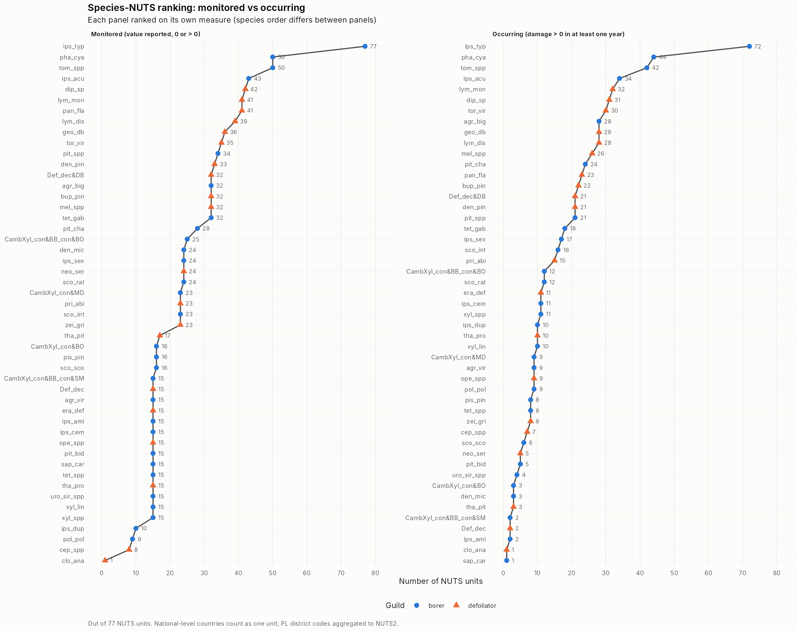

The flat step at 15 units in the *monitored* panel is Germany's 15 NUTS1 units: many insects are monitored only there. The gap between the panels shows where an insect is monitored but never found.

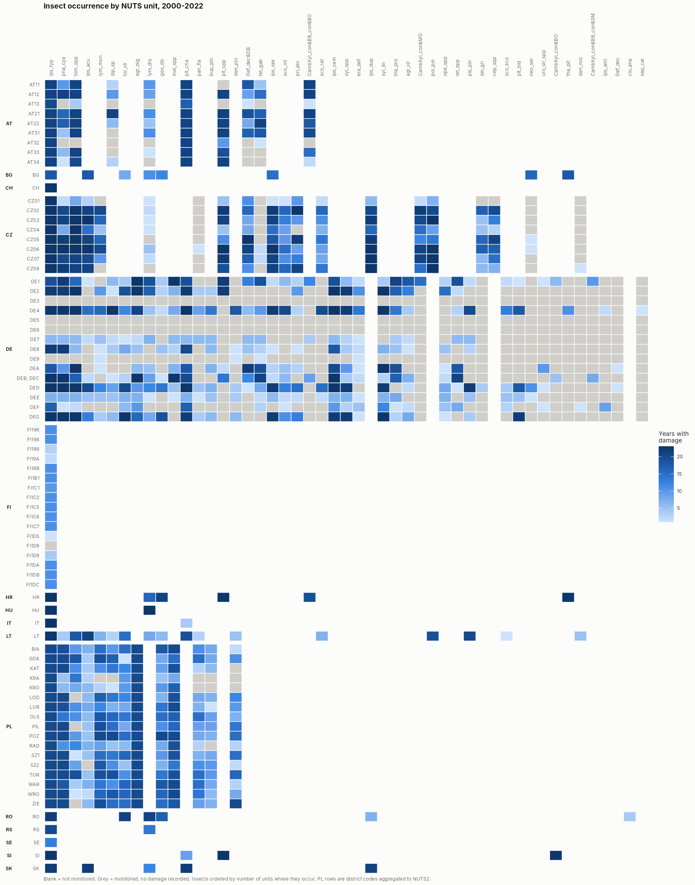

Full occurrence tables (ranking of insects by regions, ranking within each region, region × insect matrix): `outputs/tables/species_nuts_occurrence_ranking.xlsx`.

## Correlation metrics: how much does each insect tell us about the others?

For every pair of insect codes, using region-years where both are recorded:

- **Same year:** do they have bad years together? (r of within-series standardised damage)
- **Beyond shared bad years:** still linked after removing each insect's Europe-wide yearly signal? Separates a real link from both reacting to the same drought year.
- **Lead effect:** does insect A's bad year predict insect B's *next* year beyond B's own previous year? (partial correlation, Granger-type) Tests whether one disturbance sets up another.
- **Co-occurrence:** do they tend to have any damage in the same region-year?

**Uncertainty.** 95% ranges come from resampling whole regions 999 times (block bootstrap), which respects the dependence between years within a region. Ranges are given only when ≥ 5 regions contribute (`r sum(!is.na(cm$same_year_lo))` pairs). A link counts only if its range excludes zero.

```{r cm-verdicts}
cm |> count(link, name = "pairs") |>
  mutate(link = factor(link, c("strong, beyond shared bad years", "strong, mostly shared bad years",
                               "weak but real", "no clear link", "not enough data"))) |> arrange(link)
```

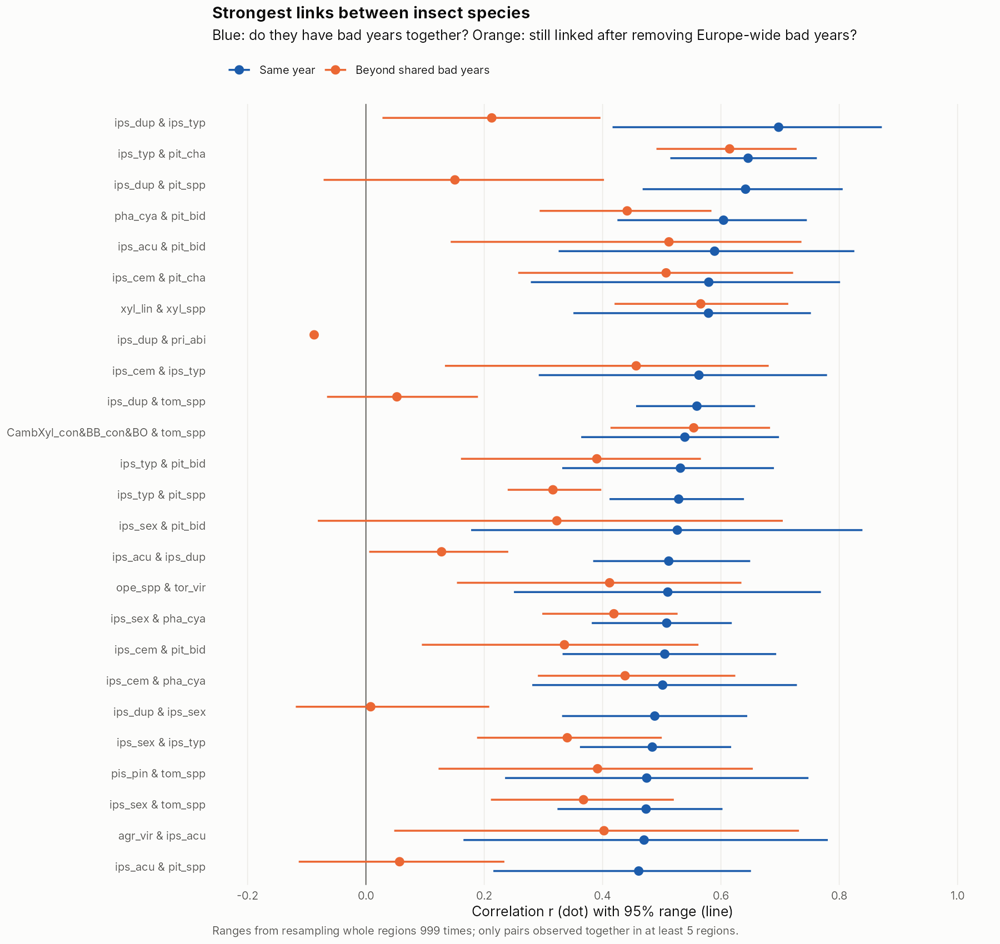

Where the two dots of a pair are close, the link holds beyond shared bad years (a local connection); where the orange dot is much lower, the pair mainly shares the same bad years.

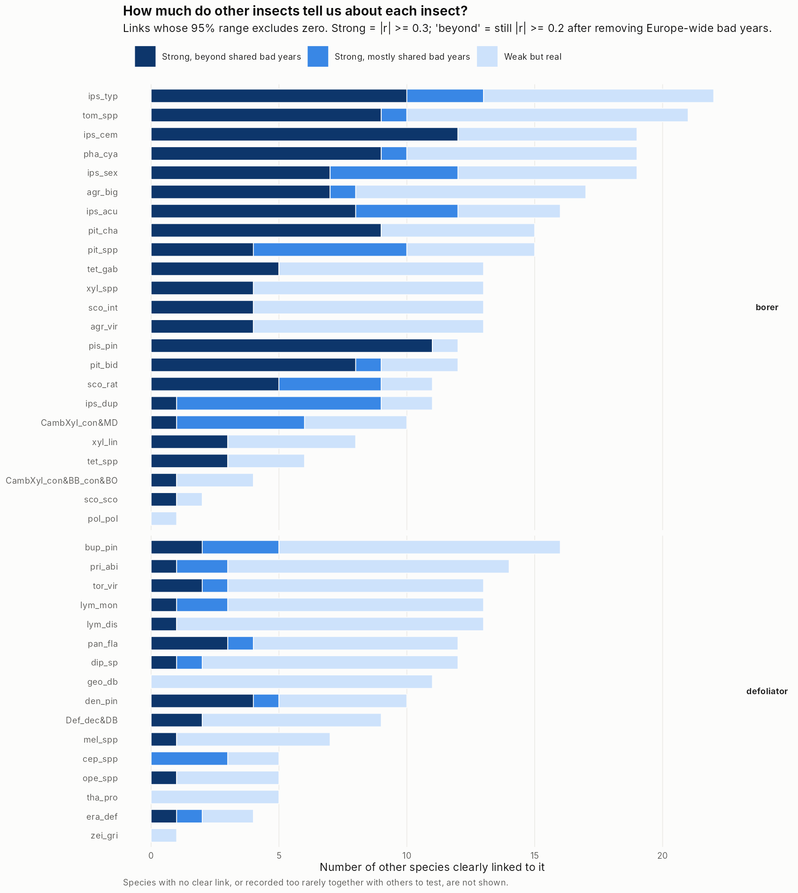

The most connected insects are `r paste0("*", cms_tot$species[1:5], "* (", cms_tot$total[1:5], ")", collapse = ", ")`: these carry the most information about other insects.

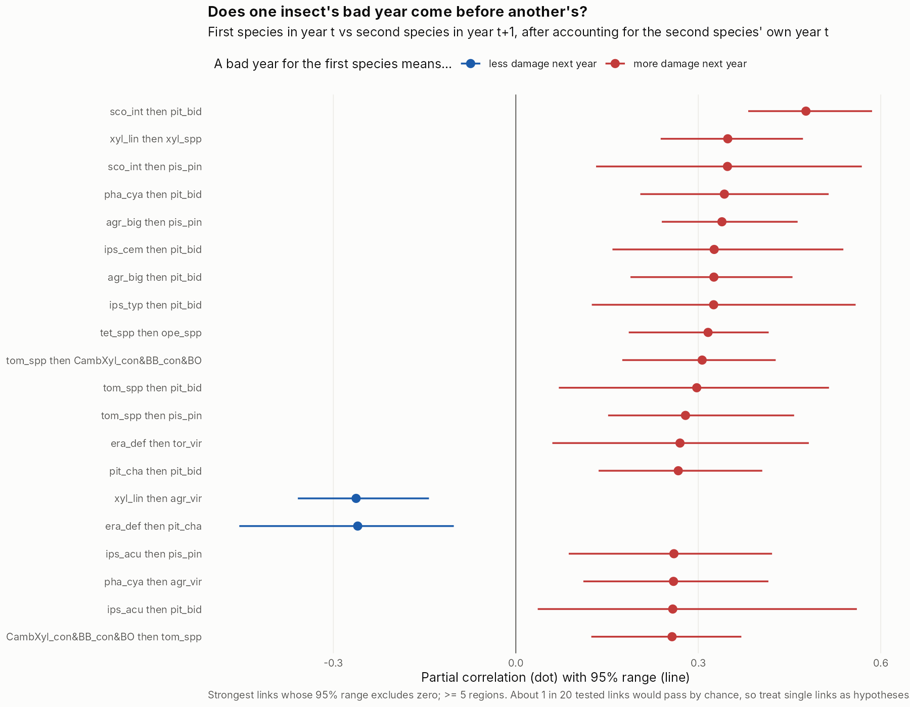

**Lead effects:** `r sum(lags$sure)` of `r sum(!is.na(lags$lo))` testable ordered pairs pass, against about `r round(0.05 * sum(!is.na(lags$lo)))` expected by chance. Sequential effects exist in the data, but any single link may be a chance result; they are candidates for the "one disturbance predisposes the next" mechanism once storm and drought records are added.

**Co-occurrence** (any damage in the same region-year) has median r = `r f2(median(cm$co_occur, na.rm = TRUE))` and tracks the same-year link only partly (r = `r f2(cor(cm$co_occur, cm$same_year, use = "complete"))`): *whether* damage occurs and *how much* behave differently, which supports a two-part model.

### Guild structure

```{r perm}
perm |> transmute(grouping, version, `mean r within group` = f2(mean_r_within),
                  `mean r between groups` = f2(mean_r_between), `p (permutation)` = signif(p_perm_one_sided, 2))
```

Insects of the same feeding guild (borer vs defoliator) correlate more strongly than insects of different guilds, also after removing Europe-wide bad years; host type alone (conifer vs broadleaf) does not separate them. Guild labels are provisional (from the file's indicator columns).


### Does a link hold in other countries?

Gaps are whole countries that never monitored an insect, so a link is only useful if it holds across countries. **Consistent** = ≥ 2 countries with ≥ 10 shared region-years, same sign everywhere, SD of country r ≤ 0.2, and no sign flip when any one country is dropped.

```{r transfer}
ts |> count(version, transferability) |> tidyr::pivot_wider(names_from = transferability, values_from = n)
```

```{r consistent}
tz |> filter(transferability == "consistent") |> arrange(desc(abs(r_pooled))) |> slice_head(n = 12) |>
  transmute(pair = paste(species_a, "&", species_b), r = f2(r_pooled), countries = countries_n10, `SD of country r` = f2(r_sd))
```


*I. typographus*, recorded almost everywhere, has links that hold across countries with *Pityokteines*, *Phaenops* and *I. acuminatus*; its strongest partner, *P. chalcographus*, is strong in Germany and Austria but not elsewhere.

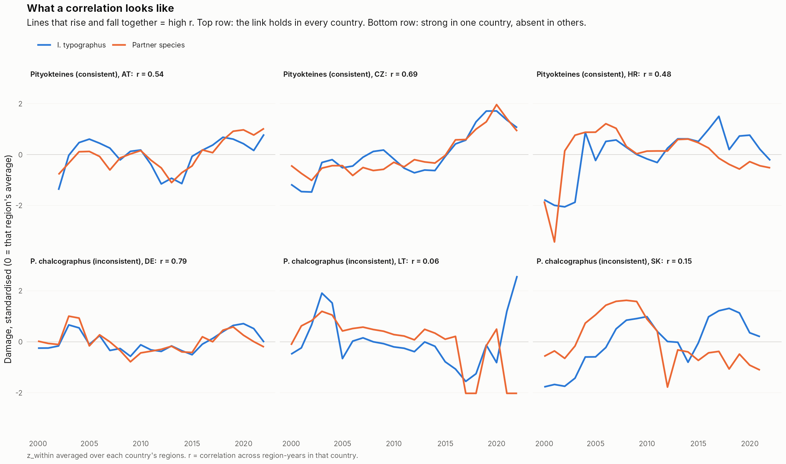

### Sensitivity: the paper's series filter

With the ≥ 6 damage-year filter of Hlásny et al. (2025), pooled same-year correlations correlate `r { j <- inner_join(pw |> filter(version == "z_within") |> select(species_a, species_b, r = r_pearson), pw6 |> filter(version == "z_within") |> select(species_a, species_b, r6 = r_pearson), by = c("species_a", "species_b")); f2(cor(j$r, j$r6, use = "complete")) }` with the main results; the filter mainly removes sparse series and many pairs with them.

## Comparison with Hlásny et al. (2025), Table 6

Summing our data over all regions per insect and year and correlating the Europe-wide totals reproduces Table 6 of the paper:

```{r t6}
t6 |> arrange(desc(paper_value)) |>
  transmute(pair = paste(species_a, "&", species_b), `paper (Table 6)` = f2(paper_value),
            `our r²` = f2(r2_ours), `our r` = f2(r_ours), `our p` = signif(p_ours, 2))
```

- The paper's values equal our **r²** (mean difference `r formatC(mean(t6$abs_diff_paper_vs_r2), format = "f", digits = 3)`), not our r (mean difference `r f2(mean(t6$abs_diff_paper_vs_r))`), so Table 6 appears to report squared correlations — which explains the paper's note that all correlations were non-negative.
- `r sum(t6$r_ours < 0)` of 36 pairs are actually negative; none reaches the paper's significance threshold (p < 0.001), so its highlighted results are unaffected. Worth raising with Prof. Hlásny.
- Europe-wide correlations (e.g. *I. typographus* & *Phaenops* r = `r f2(t6$r_ours[t6$species_a=="ips_typ" & t6$species_b=="pha_cya"])`) are much stronger than regional ones, because continental totals are dominated by a few big years and by Germany.

## Latent factor model (prototype)

**Aim (PhD objective 1):** fill gaps using all records at once, assuming that damage across insects is driven by a few shared hidden factors.

**Model.** A table of region-years × insects (`log(damage + 1)`, zeros included, empty where not monitored). Each value = insect level + overall damage intensity of that region-year + Σ (region-year score on hidden factor k × the insect's sensitivity to factor k). Fitted by alternating ridge regression on recorded cells only (`R/lfm.R`).

**Test.** Whole country × insect blocks were hidden (e.g. all Polish *Phaenops* records) and predicted from everything else, mimicking real gaps: 10-fold cross-validation over `r nrow(rd("lfm_blocks"))` blocks (only insects recorded in ≥ 2 countries can be tested). Baselines: insect average; insect × year average (Europe-wide bad years); best single helper insect.

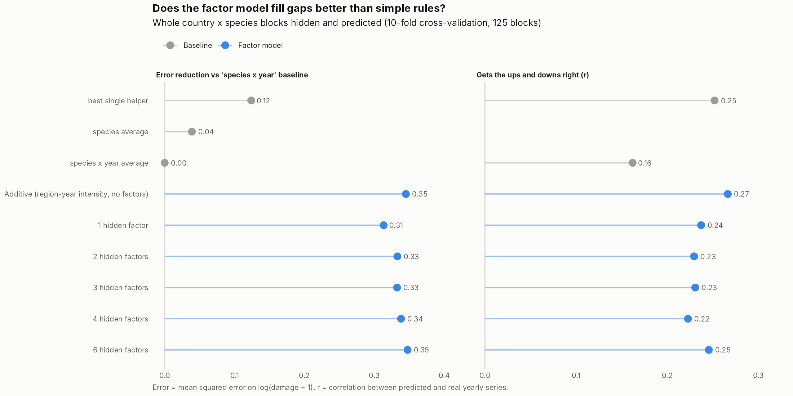

```{r lfm-scores}
lsc |> left_join(lgrid, by = "model") |> filter(is.na(K) | lambda %in% c(50, 100) | K == 0) |> arrange(rmse) |>
  transmute(model, `RMSE (log scale)` = f2(rmse), `error reduction vs insect×year` = f2(skill_vs_year_baseline),
            `ups-and-downs r` = f2(dynamics_r))
```

```{r lfm-split}
d <- lcv |> filter(model == lbest$model, !is.na(predicted)) |>
  group_by(nuts_id, species) |> mutate(e = predicted - observed, lvl = mean(e)) |> ungroup()
level_share <- mean(d$lvl^2) / mean(d$e^2)
worst <- d |> distinct(country, nuts_id, species, lvl) |> group_by(country) |>
  summarise(err = mean(abs(lvl)), .groups = "drop") |> arrange(desc(err))
```

- Chosen model: **`r lbest$model`** (simplest within 0.5% of the best). It reduces error by **`r pct(100 * lbest$skill_vs_year_baseline)`** versus insect × year averages; the best single helper reduces it by `r pct(100 * skill("Baseline: best single helper"))`. Using all insects together works better than using one.
- **Most of the gain comes from the region-year intensity term:** the purely additive model (no hidden factors) is almost as good (`r pct(100 * skill("Factor model: K=0, lambda=20"))`). With the current data, few insects are recorded together outside Germany, so insect-specific factors are hard to learn and transfer.
- **Errors are still large** (RMSE ≈ `r f2(lbest$rmse)` on the log scale). About `r pct(100 * level_share)` of the error is the *level* of damage, largest for `r paste(head(worst$country, 4), collapse = ", ")`. Without forest area or host-tree abundance the model cannot tell a small region from a whole country. The rest is year-to-year variation.

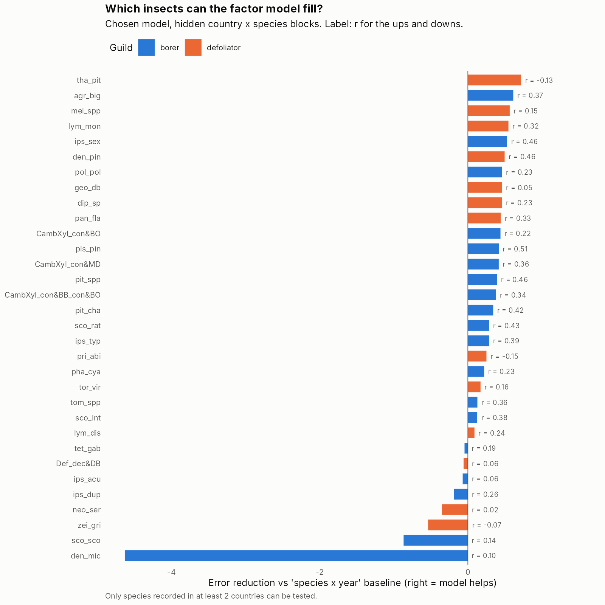

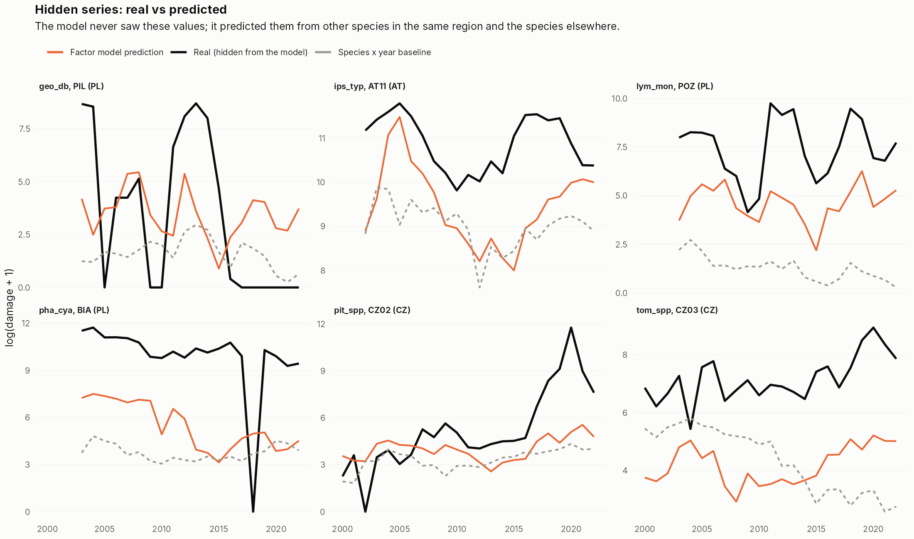

The examples are the *typical* (median) hidden series for six insects, not the best ones.

### What the model learned

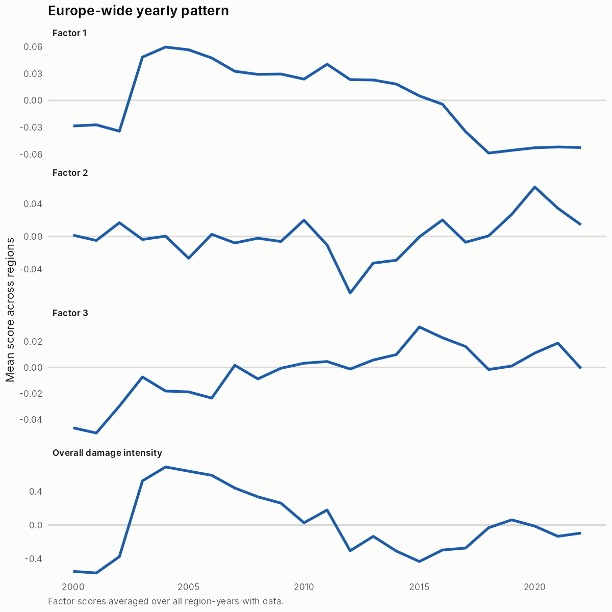

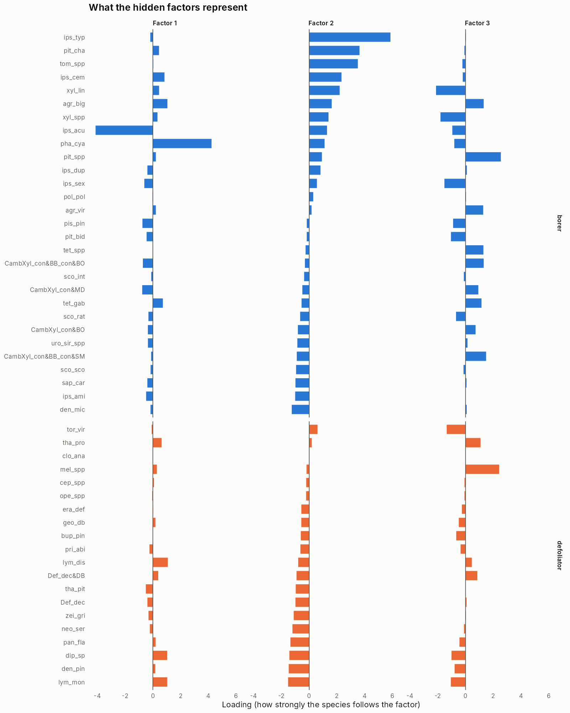

- **Overall damage intensity** peaks in **2003–06**, after the 2003 drought.
- **Factor 2** separates bark beetles (*I. typographus*, *P. chalcographus*, *Tomicus*; positive) from defoliators (negative) and is highest in 2019–21, during the large bark-beetle wave — the "divergent trends" of Hlásny et al. (2025).
- **Factors 1 and 3** have no clear ecological interpretation yet (factor 1 mainly contrasts *Phaenops* with *I. acuminatus*). They may reflect regional reporting differences; covariates (host trees, climate) should help separate ecology from reporting.

### Next steps for the model

1. **Covariates:** forest area and host-tree abundance per region (paper Appendix D) and VPD, so damage can be scaled to region size and climate.
2. **Two-part model:** "any damage?" and "how much?" separately; most recorded values are zeros (`r pct(100 * mean(tr$damage == 0))`).
3. **Uncertainty:** a Bayesian version giving each filled value a range.
4. **Abiotic damage** (storm, drought, fire) when available, likely the strongest shared factors.
5. Gap-filled values (prototype, not for totals yet): `data/processed/lfm_gap_filled_PROTOTYPE.csv`.

## Open questions for Prof. Hlásny

1. **Table 6:** are the values r² rather than r?
2. **Dataset version:** our file has `r counts$n_regions` regions and `r counts$n_species` codes; the paper reports 82 spatial units and 50 species (Zenodo 10.5281/zenodo.15863174).
3. **Appendix B and D:** conversion factors, which Polish species were split from groups by fixed proportions, and host-tree abundance per region.
4. **VPD per region** as used in the paper.
5. **CZ values in multiples of 1/7:** known cause?
6. **Other group codes:** should any besides the CZ spruce group be mapped to a dominant species?

## Files

- Correlation metrics: `outputs/tables/correlation_metrics_all_pairs.csv`, `correlation_metrics_by_species.csv`, `correlation_metrics_lagged.csv`
- Transferability: `per_country_correlations.csv`, `leave_one_country_out.csv`, `transferability_summary.csv`
- Factor model: `lfm_cv_scores_by_model.csv`, `lfm_cv_scores_by_species.csv`, `lfm_factor_loadings.csv`
- Occurrence: `species_nuts_occurrence_ranking.xlsx`; coverage: `coverage_*.csv`; Table 6 replication: `paper_table6_replication.csv`
- Figures: `outputs/figures/`
